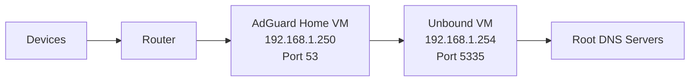

# 🌐 Network Map – AdGuard + Unbound HomeLab

This document maps the network topology, IPs, ports, and VM names for the **AdGuard Home + Unbound** home lab running on **Proxmox VE**.

---

## 1️⃣ Overview Diagram

```text
+-----------------+        +-----------------+        +-------------------+
|                 |        |                 |        |                   |
|   Devices       |  --->  |     Router      |  --->  |  AdGuard Home VM  |
| (PCs, Phones)  |        | 192.168.1.1     |        | 192.168.1.250     |
|                 |        |                 |        | Port 53 (DNS)     |
+-----------------+        +-----------------+        +-------------------+
                                                            │
                                                            ▼
                                                    +-------------------+
                                                    |                   |
                                                    |   Unbound VM      |
                                                    | 192.168.1.254     |
                                                    | Port 5335 (DNS)   |
                                                    +-------------------+
                                                            │
                                                            ▼
                                                    +-------------------+
                                                    | Root DNS Servers  |
                                                    +-------------------+
```

---

## 2️⃣ VM / LXC Details

| VM/LXC Name    | Role          | IP Address    | CPU | RAM   | Ports                   |
| -------------- | ------------- | ------------- | --- | ----- | ----------------------- |
| `unbound-home` | Recursive DNS | 192.168.1.254 | 1   | 512MB | 5335 (DNS)              |
| `adguard-home` | DNS + AdBlock | 192.168.1.250 | 1   | 1GB   | 53 (DNS), 3000 (Web UI) |

---

## 3️⃣ Router Settings

* LAN DNS: `192.168.1.250` (AdGuard Home)
* Optional: block outbound DNS to external servers to enforce network-wide filtering

---

## 4️⃣ Ports Overview

| Service        | VM / LXC     | Port | Protocol |
| -------------- | ------------ | ---- | -------- |
| AdGuard DNS    | adguard-home | 53   | UDP/TCP  |
| AdGuard Web UI | adguard-home | 3000 | TCP      |
| Unbound DNS    | unbound-home | 5335 | UDP/TCP  |

---

## 5️⃣ Notes & Best Practices

* Keep **static IPs** for both VMs for consistency.
* Ensure **AdGuard Home forwards upstream DNS** to **Unbound** (`192.168.1.254:5335`).
* LXCs are preferred for lightweight setups, VMs for full isolation.
* Document any firewall or VLAN rules here for clarity.

---

## 6️⃣ Optional Visualization

You can create a **Mermaid diagram** for GitHub README rendering:



*This renders directly in GitHub Markdown for a clean visual representation.*

---
